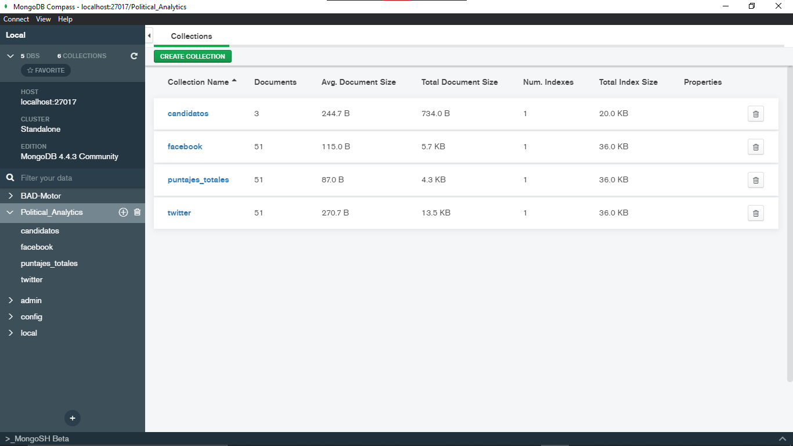

## Instalacion
Para arrancar el servidor en python, debe intalar las siguientes librerias.
 - Bottle => pip install bottle
 - MongoDB => pip install pymongo
 
y tener instalado el gestor de base de datos MongoDB.

## Arrancar el servidor
Para arrancar el servidor debera de correr el archivo que esta en \Servidor\main.py y este al arranca crea un servidor de HTTP en el puerto 8080 (http://127.0.0.1:8080/). Las direcciones que usa son las siguientes: 
    - http://127.0.0.1:8080/consulta => Consulta de la informacion a la base de datos, analisa y regresa la informacion que json 
    - http://127.0.0.1:8080/recoleccion/api-webScraping => Recoleta informacion de API de Twitter y Web Scraping de Facebook, Analiza y Almacena en la Base de Datos 
 
<strong>
Una ves arriba el servidor debera consultar 2 veces la url (http://127.0.0.1:8080/recoleccion/api-webScraping), para generar dos puntos de analizis y con este podra hacer la regresion lineal para predicciones.
</strong>
 
Para visualizar los resultados debera abrir el archivo (\Cliente\index.html), y aqui podra visualizar los datos del servidor  
Tambien podra hacer un analizis de datos con el boton llamado (Recoleccion de Datos), y cuando este termine recarge la paguina para ver los nuevos datos  
<strong>Se necesitan recolectar varios datos en varios dias, para ver el progreso que se tienen en los datos</strong>

## Evidencia de Pruebas
Paguina Principal

Base de Datos

